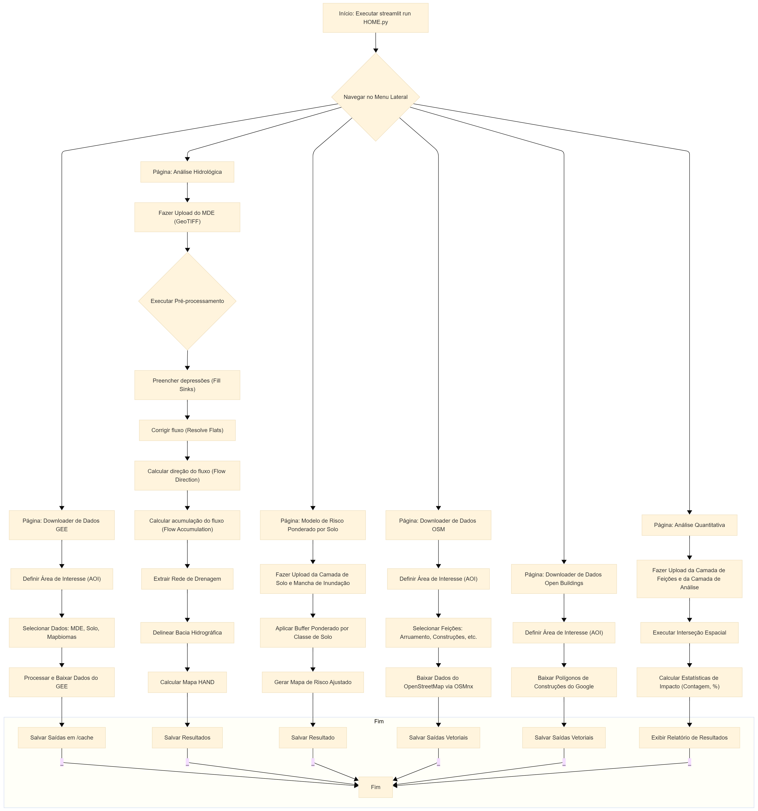

# 🛰️ Plataforma de Análise Geoespacial Integrada 🌎

## Descrição

Esta plataforma é uma aplicação web de análise geoespacial que integra diversas ferramentas de geoprocessamento e sensoriamento remoto. O objetivo principal é fornecer uma interface amigável para realizar análises hidrológicas, de risco e de impacto, utilizando dados de fontes como Google Earth Engine (GEE), OpenStreetMap (OSM) e Google Open Buildings.

## Fluxograma do Projeto



## Principais Funcionalidades

*   **Download de Dados (GEE)**: Download de Modelos Digitais de Elevação (MDE/DEM) e outras imagens via Google Earth Engine.
*   **Análise Hidrológica Local**: Delimitação de bacias hidrográficas e cálculo do índice HAND (*Height Above the Nearest Drainage*).
*   **Modelo de Risco do Solo**: Identifica e quantifica feições (construções e arruamentos) em áreas de risco com base em limiar de inundação definido pelo usuário.
*   **Download de Dados OSM**: Acesso a dados do OpenStreetMap (arruamentos, edificações e outros).
*   **Download Open Buildings**: Acesso aos dados de edificações do Google Open Buildings.
*   **Estatísticas**: Geração de estatísticas e relatórios quantitativos sobre as análises realizadas.
*   **Visualização Interativa**: Resultados exibidos em mapa interativo via Folium/geemap.
*   **Exportação de Resultados**: Download dos dados gerados (rasters e vetores) para uso em SIG.

## Pré-requisitos

*   **Python 3.10 ou superior**
*   Todas as dependências estão no arquivo `requirements.txt`.

## Instalação

1.  **Clone o repositório:**
    ```bash
    git clone <URL_DO_REPOSITORIO>
    ```

2.  **Crie e ative um ambiente virtual (recomendado):**
    ```bash
    python -m venv venv
    venv\Scripts\activate   # Windows
    source venv/bin/activate  # Linux/Mac
    ```

3.  **Instale as dependências:**
    ```bash
    pip install -r requirements.txt
    ```

4.  **Autentique no Google Earth Engine (primeira vez):**
    ```bash
    earthengine authenticate
    ```

## Como Usar

1.  **Execute a aplicação Streamlit:**
    ```bash
    streamlit run HOME.py
    ```

2.  **Acesse no navegador:** `http://localhost:8501`

3.  **Navegue pelas páginas** usando o menu da barra lateral.

## Estrutura do Projeto

```
.
├── HOME.py                          # Página inicial da aplicação Streamlit
├── pages/                           # Páginas da aplicação
│   ├── 1_Download_de_Dados.py       # Download de dados via GEE
│   ├── 2_Análise_Hidrológica_Local.py # Delimitação de bacia e HAND
│   ├── 3_Modelo_Risco_Solo.py       # Análise de risco por cota de inundação
│   ├── 4_Downloader_OSM.py          # Download de dados OpenStreetMap
│   ├── 5_Download_Open3B.py         # Download Google Open Buildings
│   └── 6_statistics.py              # Estatísticas e relatórios
├── scripts/                         # Módulos de lógica de processamento
│   ├── gee_helpers.py               # Funções auxiliares para GEE
│   └── local_analysis_helpers.py    # Funções para análise local
├── insumos/                         # Documentação das camadas e processos
├── Fluxograma/                      # Fluxograma do sistema (Mermaid + PNG)
├── bacia.geojson                    # Exemplo de área de interesse
├── INSTRUCOES.txt                   # Tutorial passo a passo para o usuário
├── atualizacoes.doc                 # Registro de atualizações e correções
├── readme.md                        # Este arquivo
└── requirements.txt                 # Dependências Python
```

## Dependências (requirements.txt)

| Pacote | Finalidade |
|---|---|
| `earthengine-api` | Acesso ao Google Earth Engine |
| `geemap` | Mapas interativos com GEE |
| `geopandas` | Processamento de dados vetoriais |
| `numpy` | Computação numérica |
| `osmnx` | Download e análise de dados OSM |
| `pandas` | Manipulação de dados tabulares |
| `pyproj` | Transformações de projeção |
| `pysheds` | Análise hidrológica (bacias, HAND) |
| `rasterio` | Leitura/escrita de rasters GeoTIFF |
| `requests` | Requisições HTTP |
| `s2sphere` | Indexação espacial S2 |
| `shapely` | Geometrias vetoriais |
| `tqdm` | Barras de progresso |
| `streamlit` | Framework da aplicação web |
| `streamlit-vertical-slider` | Controle deslizante vertical na UI |
| `streamlit-toggle` | Botão de alternância na UI |
| `leafmap` | Mapas interativos complementares |
| `python-box>=7.0` | Dicionários acessíveis por atributo |


*Projeto desenvolvido como trabalho final da Pós-Graduação em Inteligência de Dados Geográficos — Pedro Casagrande Gianini, 2025.*